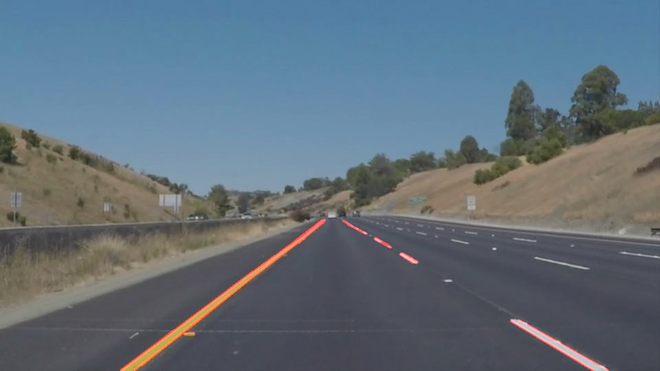

# **Finding Lane Lines on the Road** 

---

**Finding Lane Lines on the Road**

The goals / steps of this project are the following:
* Make a pipeline that finds lane lines on the road
* Reflect on the work in a written report

---

### 1. Describe your pipeline. As part of the description, explain how you modified the draw_lines() function.

My pipeline consisted of 5 steps, which follows the procedures learned from the practice. First, the images is converted to grayscale. Then Gaussian Blur is applied on the grayscale image to smoothen the image. After that Canny Edge detection is used to find the strong edges, which contain the lane lines we are interested in. And the next step is specifying the lane region in the image, which could help filter out unnecessary edges detected. Finally I utilized Hough transform to detect the straight lines from the remaining edges. And the results are the lane lines we want after tuning the paramters. The parameters include kernel size for Gaussian Blur, low/high threshold for Canny Edge detection, Region of interests and Hough Line detection input(intersection threshold, minmum length and maxmum distance).

The example results from the pipeline are:

In order to draw a single line on the left and right lanes, I modified the draw_lines() function in the following way:
For each detected lane line is computed, the slope, length and center position is calculated. Then the slope value is used to determine whether the lane belongs to the left lane or the right one. Positive slope value means it is a part of right lane and negative value is the opposite. Here a lower threshold limit is added to help filtering out the flat lines detected. It is very helpful to secure a more accurate lane detection for the solidYellowLeft.mp4 example video.

Then for the two group of lines, the average center point and slope is computed using the line length as the weight. In this case, a longer detected line can have larger impact on the final average result, which could help improve the accuracy. 

Taking the calculated average center points and slope, together with the Y coordinates of the specified range, we can calculate the start and end X coordinates for each line. The top and bottom of the lane is then extrapolated.

#### Modification for the Challenge Video
To get the lane detection worked on the challenge video, one more step to convert the image to HLS range. The idea is got from this [artical](https://towardsdatascience.com/teaching-cars-to-see-advanced-lane-detection-using-computer-vision-87a01de0424f) and the oringinal [code](https://github.com/kenshiro-o/CarND-LaneLines-P1/blob/master/Lane_Detection_Term_1.ipynb). The pipeline which first detect the white and yellow lanes from the original image and then apply same idea mentioned above. It can more robust detect the lanes in strong sunshine

### 2. Identify potential shortcomings with your current pipeline

There could be several potential shortcomings in the current pipeline:

1. The region of interest need to be input manually for videos of different sizes. Ideally the pipeline could include algorithm to compute the this region.

2. The parameters used might not be robust enough, it might need tuning if appiled on a different video.

3. The movement of the detected lanes is not smooth, sometime it could jump to a different position when an unexpected edge detected.  

### 3. Suggest possible improvements to your pipeline

To cover the shortcomings mentioned above, some possible improvements would be:
1. Compute the area of interest with certain algorithm instead of inputing manually. We might try detecting the horizon first then get a trapezoid region from that.

2. Apply a more advanced algorithm which could self calibrate itself, or simply implement a few preset parameters then iterate through and choose the optimal results.

3. After the lanes are computed, apply a filter on the detected lane result to make it move smoother. The easiest implementation could be a moving average.

4. The code could be written in a cleaner and more organized way. The current pipiline requires some effort when tuning the parameters.
