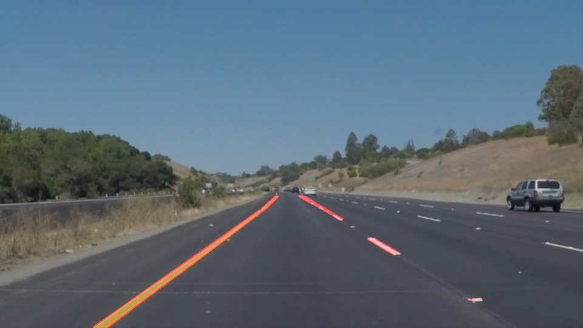

# **Finding Lane Lines on the Road** 

## Writeup Template

### You can use this file as a template for your writeup if you want to submit it as a markdown file. But feel free to use some other method and submit a pdf if you prefer.

---

**Finding Lane Lines on the Road**

The goals / steps of this project are the following:
* Make a pipeline that finds lane lines on the road
* Reflect on your work in a written report

[//]: # (Image References)

[image1]: ./examples/grayscale.jpg "Grayscale"

---

### Reflection

### 1. Describe your pipeline. As part of the description, explain how you modified the draw_lines() function.

My pipeline consisted of 5 steps, which follows the procedures learned from the practice. First, the images is converted to grayscale. Then Gaussian Blur is applied on the grayscale image to smoothen the image. After that Canny Edge detection is used to find the strong edges, which contain the lane lines we are interested in. And the next step is specifying the lane region in the image, which could help filter out unnecessary edges detected. Finally I utilized Hough transform to detect the straight lines from the remaining edges. And the results are the lane lines we want after tuning the paramters. The parameters include kernel size for Gaussian Blur, low/high threshold for Canny Edge detection, Region of interests and Hough Line detection input(intersection threshold, minmum length and maxmum distance).

The example results from the pipeline are:

In order to draw a single line on the left and right lanes, I modified the draw_lines() function in the following way:
For each detected lane line is computed, the slope, length and center position is calculated. Then the slope value is used to determine whether the lane belongs to the left lane or the right one. Positive slope value means it is a part of right lane and negative value is the opposite. Here a lower threshold limit is added to help filtering out the flat lines detected. It is very helpful to secure a more accurate lane detection for the solidYellowLeft.mp4 example video.

Then for the two group of lines, the average center point and slope is computed using the line length as the weight. In this case, a longer detected line can have larger impact on the final average result, which could help improve the accuracy. 

Taking the calculated average center points and slope, together with the Y coordinates of the specified range, we can calculate the start and end X coordinates for each line. The top and bottom of the lane is then extrapolated.

#### Modification for the Challenge Video
https://towardsdatascience.com/teaching-cars-to-see-advanced-lane-detection-using-computer-vision-87a01de0424f
https://github.com/kenshiro-o/CarND-LaneLines-P1/blob/master/Lane_Detection_Term_1.ipynb

### 2. Identify potential shortcomings with your current pipeline

One potential shortcoming would be what would happen when ... 

Another shortcoming could be ...

### 3. Suggest possible improvements to your pipeline

Some possible improvements would be:
1. Compute the area of interst with certain algorithm instead of specifying it
